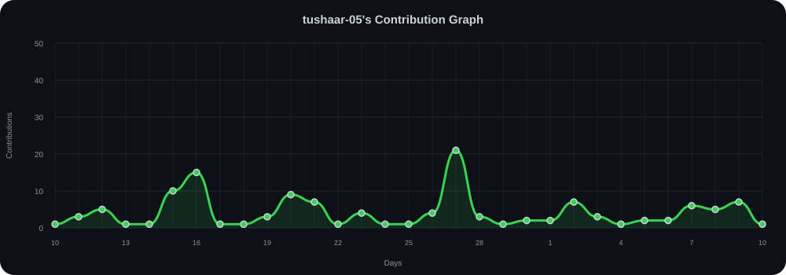

  

<h1 align="center">
  Hey there! I'm Tushar Singh
</h1>

<h3 align="center">
  FullStack Developer | Open Source Contributor | Sophomore
</h3>

  

---

## About Me  
- A **full stack developer** who loves building clean, modern websites and apps where design, functionality, and even the smallest details matter.
- Exploring AI-powered applications, scalable backend systems, and modern web architectures.
- 2nd year B.Tech student actively contributing to open-source communities.

---

## Featured Projects

| Project | Description | Tech Stack | Links |
| :--- | :--- | :--- | :--- |
| **Preper** | Full-stack exam and interview preparation platform featuring authentication, payments & mock assessments | `Python` `Flask` `SQLAlchemy` `MySQL` | [Live Demo](https://preper.co.in) • [GitHub](https://github.com/tushaar-05/Preper) |
| **Tekron NST '26** | Official platform for annual flagship tech fest Tekron NST with event schedules and registrations | `React` `JavaScript` `Tailwind` | [Live Demo](https://tekronfest.com/) • [GitHub](https://github.com/tushaar-05/tekron_NST26) |
| **Significo** | Modern web experience featuring fluid layouts, creative UI transitions, and smooth scroll animations | `Tailwind` `GSAP` `JavaScript` `HTML5` | [Live Demo](https://siignifico.netlify.app/) • [GitHub](https://github.com/tushaar-05/Significo) |
| **NST-SDC** | Student Development Club (SDC) website for community activities, initiatives, and resources | `React` `Vite` `JavaScript` `Tailwind` | [Live Demo](https://nst-sdc-coral.vercel.app) • [GitHub](https://github.com/tushaar-05/nst-sdc) |
| **Miles4Smiles** | Non-profit initiative web platform for social impact, charity 5k run event. | `TypeScript` `React` `Next.js` | [Live Demo](https://milesforsmiles-flame.vercel.app) • [GitHub](https://github.com/tushaar-05/Miles4Smiles) |
| **Smart Classroom Management** | Role-based system for managing classroom attendance, grading, equipment bookings & analytics | `Python` `SQLite` `CLI` | [GitHub](https://github.com/tushaar-05/Smart-Classroom-Management) |

---

## Tech Stack

### Languages & Frontend

  

### Backend & Databases

  

### DevOps, Cloud & Tools

  

## Currently Learning

  

---

## Contribution Graph

  

---

## GitHub Stats & Streak

  
  

---

  

---

## Connect With Me  

  
  
  
  
  

---

  

